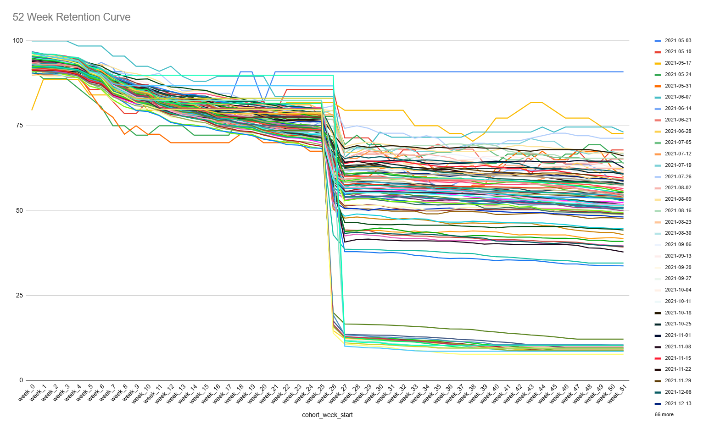
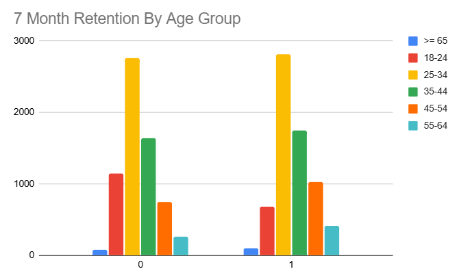

# Insurance Company Business Analysis

## Objective: Insurance company business analysis looking at users, policies, and demographic data. Made business recommendations given user retention behavior.

## Findings:

For Q1 2023 (and to a lesser extent, Q1 2022), there is a significant drop in retention (~ -80 pp). This looks like seasonality since this pattern occurs across multiple cohorts, where the cohort start date is in Q1. From a business perspective, this is probably due to people looking at their subscriptions at the beginning and end of each year and cancelling.

Older age groups (especially 45+) had higher retention vs. 18-24, which had the lowest retention rate. After running a chi-square test, the p-value is way smaller than .05, meaning that there is a statistically significant relationship between age group and retention rate.
Possibly more stable in financial habits and less price-sensitive
Customers in older age groups are more likely to retain because they often have more stable driving records, greater life stability, and may prioritize safety and service over premium price

## Business Recommendations

New analysis: A/B test retention outcomes when adjusting the following criteria on all available user attributes (credit, claims, age, etc.). Additional useful data (to conduct aforementioned tests on) could include:

Premium size
Payment/billing method 
Contact frequency with customer service (# of service tickets)
Policy changes within the first 3 months

Other analyses: After doing this, may be worth completing the data for marital status, occupation, and other demographic fields to identify other product offerings. 

I recommend experimenting and launching a mid-policy engagement campaign personalized check-ins or policy reviews around week 25). This would help preempt cancellations, especially for Q1 cohorts, by reminding users of value, offering re-quotes, or suggesting bundle savings. This could improve retention where seasonal dips occur too. In other words, I am suggesting a customer lifecycle marketing campaign to ensure engagement at the critical inflection point in retaining and churning a customer. 
